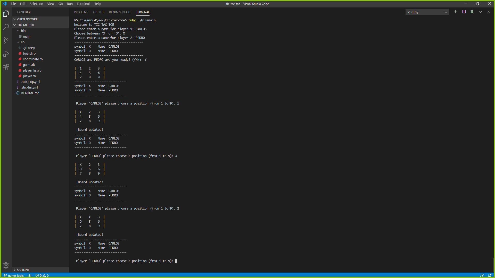

# Tic Tac Toe

In this project, the student builds a Tic Tac Toe game. The main goal is to put into practice the main concepts of Object Oriented Programming. Particularly, classes and access to their attributes.

## Project specifications

Build a tic-tac-toe game on the command line where two human players can play against each other and the board is displayed in between turns.

more about the specifications  [Wikipedia](https://en.wikipedia.org/wiki/Tic-tac-toe)

## Link to assignment

the assignment can be found  [here](https://www.theodinproject.com/courses/ruby-programming/lessons/oop).

## Usage

To run the game you should add execute permissions to the main file. [Here](https://commandercoriander.net/blog/2013/02/16/making-a-ruby-script-executable/) you can find more information. 

    chmod 755 main.rb

After that you can start the game by running

    ./bin/main.rb

## Instructions

Tic Tac Toe is a game for two players who take turns to mark spaces in a 3x3 grid board, using the symbols 'X' and 'O'.

In this game each cell of the board is represented by a position(number) from 1 to 9, as shown below:

    |  1    2    3  |
    |  4    5    6  |
    |  7    8    9  |

When starting the game, it is going to ask you for the names of the players. For example:
    
    Please enter a name for player 1:

And after the name of the first player, it is going to ask you for the symbol:
    
    Choose between 'X' or 'O':

Then it will show you the names of the two players and the symbol for each one. And you can start playing!
    
    --------------------------------------
    symbol: X    Name: ARIEL CAMUS
    symbol: O    Name: WILLOW
    --------------------------------------
    ARIEL CAMUS and WILLOW are you ready? (Y/N):

The game will ask for a position representing the current player's move on the board.
    
    Player 'ARIEL CAMUS' please choose a position (from 1 to 9): 

Unless there is a winner or the board gets full (which means it is a draw), the game will ask to the next player for choosing another position.

A winner will be found when a player gets a single line (horizontal, vertical or diagonal) with the same symbol.

For example, the following board shows an horizontal line winning move for the player X:

    |  1    2    O  |
    |  X    X    X  |
    |  7    O    9  |

## Built With

Concepts used on this project

- Ruby
- OOP 
- Yield

Tools used on this project

- Visual Studio Code
- VSCode Ruby by Stafford Brunk 0.27.0
- Rubocop 0.8.3

## Screenshot

## Live Demo

You can see the [live preview](https://repl.it/@RubenPaz/tic-tac-toe)

## Authors

👤 **Xóchitl Selene Flores Pérez**

- Github: [@enelesmai](https://github.com/enelesmai)
- Twitter: [@enelesmai](https://twitter.com/enelesmai)
- Linkedin: [xochitlselene](https://linkedin.com/in/xochitlselene)

👤 **Ruben Paz Chuspe**

- Github: [@rubenpazch](https://github.com/rubenpazch)
- Linkedin: [rubenpch](https://www.linkedin.com/in/rubenpch/)

## Contributing

This is an education project as a part of the Microverse so contributing is not accepted. 

Contributions, issues and feature requests are welcome!

Feel free to check the [issues](https://github.com/enelesmai/tic-tac-toe/issues).

## Show your support

Give a ⭐️ if you like this project!

## Acknowledgements

+ [Microverse](https://www.microverse.org/).
+ [Github](http://github.com/).
+ [The Odin Project](theodinproject.com/).

## License

This project is [MIT](lic.url) licensed.

